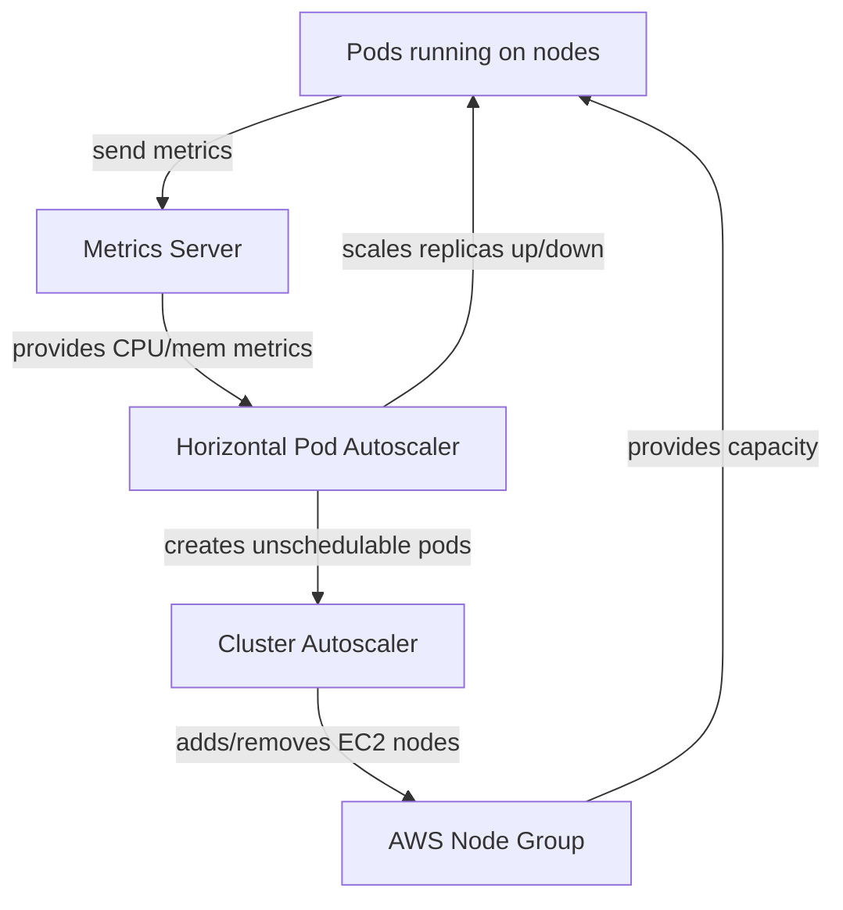
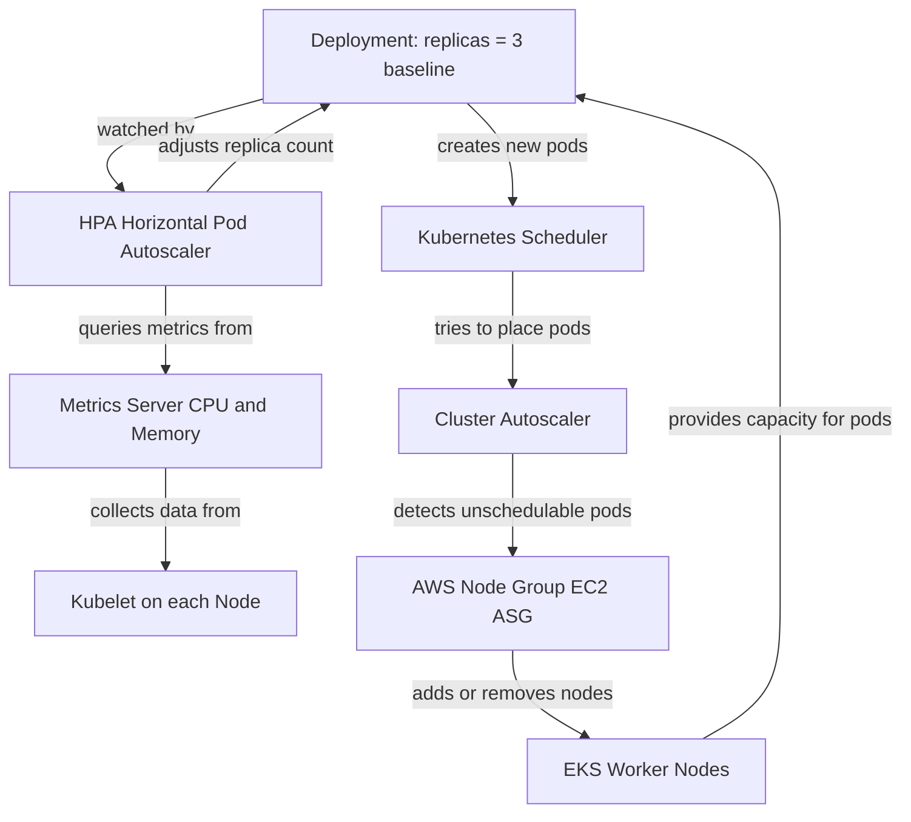

Excellent 👏 — let’s build a **clear, structured, and logically connected explanation** that covers:
1️⃣ Metrics Server → what it does and what it needs.
2️⃣ Horizontal Pod Autoscaler (HPA) → how it uses metrics.
3️⃣ Cluster Autoscaler → how it reacts to unschedulable pods.
4️⃣ How all three **work together** in EKS.

This will be **Confluence-ready** and designed for future reference — simple, sequential, and logical.

---

# ⚙️ EKS Autoscaling — How Metrics Server, HPA, and Cluster Autoscaler Work Together

---

## 1️⃣ Metrics Server — the foundation of autoscaling

### 🔍 What it is

The **Metrics Server** is a Kubernetes component that collects **resource usage metrics** (CPU and memory) from every node and pod in the cluster.

It serves these metrics through the **Kubernetes Metrics API** (`metrics.k8s.io`), which other components — like the **HPA** — can query.

### 🧠 What it needs to work

* **RBAC permissions** to read from the Kubelet on each node.
* **Access to Kubelet metrics endpoints**, which is why we add these flags in Helm:

  ```yaml
  --kubelet-insecure-tls
  --kubelet-preferred-address-types=InternalIP,Hostname
  ```
* **Resource limits and requests** set on Pods → HPA uses *requests* as a reference baseline (e.g., target 60% of requested CPU).

### 📊 What it provides

Once installed, you can query metrics:

```bash
kubectl top nodes
kubectl top pods -A
```

If these commands show live CPU and memory usage, Metrics Server is working.

---

## 2️⃣ Horizontal Pod Autoscaler (HPA) — scaling Pods

### 🔍 What it does

The **HPA** automatically adjusts the **number of running Pods** in a Deployment, ReplicaSet, or StatefulSet based on metrics like CPU, memory, or custom metrics.

It talks to the **Metrics Server** to understand how busy your Pods are.

### 🧩 Logical chain

1. Metrics Server collects CPU/memory data from nodes and pods.
2. HPA queries this data periodically (default every 15s).
3. If average utilization > target → HPA increases replicas.
4. If utilization < target → HPA decreases replicas.

### ⚙️ Example

You define in Terraform or YAML:

```yaml
apiVersion: autoscaling/v2
kind: HorizontalPodAutoscaler
metadata:
  name: web-hpa
spec:
  scaleTargetRef:
    apiVersion: apps/v1
    kind: Deployment
    name: web
  minReplicas: 2
  maxReplicas: 10
  metrics:
    - type: Resource
      resource:
        name: cpu
        target:
          type: Utilization
          averageUtilization: 60
```

* The HPA watches the `web` Deployment.
* Each pod has a `requests.cpu` of `150m`.
* If the average CPU use exceeds `90m` (60% of 150m), the HPA increases replicas.
* If it drops below the target, it reduces replicas — but never below `minReplicas`.

### 🔁 What it needs

✅ **Metrics Server running**
✅ **Workload with CPU/Memory requests defined**
✅ **HPA object deployed**

Without any of these, HPA won’t function.

---

## 3️⃣ Cluster Autoscaler (CA) — scaling Nodes

### 🔍 What it does

The **Cluster Autoscaler** works at the infrastructure level.
It scales **EKS worker nodes** up or down based on scheduling needs.

It runs as a pod (usually in `kube-system`) and monitors the cluster scheduler.

### 🧩 Logical chain

1. When HPA increases replicas, Kubernetes tries to place new pods.
2. If there aren’t enough resources (CPU/memory on existing nodes), those pods become **Pending**.
3. The Cluster Autoscaler detects these unschedulable pods.
4. It adds new EC2 nodes (via managed node groups or ASGs).
5. When pods finish and nodes are empty, CA removes extra nodes.

So, **HPA drives pod demand**, and **CA provides supply (nodes)** to host them.

---

## 4️⃣ How All Three Work Together



### 🧠 Step-by-Step Logic

1️⃣ **Metrics Server**

* Continuously collects metrics from all nodes/pods.
* Makes them available through the `metrics.k8s.io` API.

2️⃣ **HPA**

* Periodically checks metrics from Metrics Server.
* Adjusts the number of replicas in the Deployment.

3️⃣ **Cluster Autoscaler**

* Monitors the scheduler.
* If new pods can’t fit on current nodes → adds more nodes.
* If nodes are idle → removes them after a grace period.

### 💬 Real Example

Let’s simulate a web app:

| Component          | What happens                                    | Why                 |
| ------------------ | ----------------------------------------------- | ------------------- |
| Metrics Server     | Reports each pod uses 85% CPU                   | Traffic increased   |
| HPA                | Target = 60%, current = 85% → scales pods 2 → 6 | To handle load      |
| Cluster Autoscaler | Some new pods pending → adds 2 nodes            | To host extra pods  |
| Metrics Server     | Reports CPU < 30%                               | Load decreased      |
| HPA                | Reduces pods 6 → 2                              | To save capacity    |
| Cluster Autoscaler | Sees 2 nodes empty → removes them               | Cost optimization ✅ |

---

## 🧰 Summary of Components and Responsibilities

| Component              | Layer          | Scales | Input         | Output             | Deployed via            |
| ---------------------- | -------------- | ------ | ------------- | ------------------ | ----------------------- |
| **Metrics Server**     | Observability  | N/A    | Kubelet stats | Metrics API        | Helm / Terraform        |
| **HPA**                | Application    | Pods   | Metrics API   | Adjusted replicas  | Kubernetes (native API) |
| **Cluster Autoscaler** | Infrastructure | Nodes  | Pending Pods  | Adds/removes nodes | Helm / Terraform        |

---

## 💰 Why this saves cost (end-to-end)

* **HPA alone** saves *application capacity* — not cloud cost.
* **CA reacts to HPA’s scaling decisions** and actually adds/removes EC2 nodes.
* When demand drops → fewer pods → fewer nodes → AWS charges drop.
* The combination gives *performance + cost optimization* automatically.

---

## 🧩 What to verify in your cluster

```bash
# Metrics Server health
kubectl -n kube-system get pods -l k8s-app=metrics-server
kubectl top nodes
kubectl top pods -A

# HPA behavior
kubectl get hpa -A
kubectl describe hpa <name>

# Cluster Autoscaler health
kubectl -n kube-system get pods -l app.kubernetes.io/name=cluster-autoscaler
kubectl -n kube-system logs deploy/cluster-autoscaler-aws-cluster-autoscaler | tail
```

---

## ✅ TL;DR (Logical Chain)

| Step | Component              | Action                                                                 |
| ---- | ---------------------- | ---------------------------------------------------------------------- |
| 1️⃣  | **Metrics Server**     | Collects real-time CPU/memory metrics from pods/nodes.                 |
| 2️⃣  | **HPA**                | Reads those metrics and adjusts deployment replicas.                   |
| 3️⃣  | **Cluster Autoscaler** | Adds/removes EC2 nodes when pods can’t be scheduled or nodes are idle. |
| 🔁   | **All together**       | Automatic, dynamic scaling from application to infrastructure.         |

---

Would you like me to turn this explanation into a **Confluence-ready diagram section** (with short bullet blocks, emojis, and tables, matching your Kubernetes documentation style)? It will align visually with your previous Confluence pages on EKS architecture and addons.

💯 Excellent — you’ve caught a **key subtlety** that many people misunderstand!
Let’s unpack it carefully and clearly 👇

---

# 🧩 Question

> When I deploy an HPA to watch a Deployment (for example, `app`), do I still need to define the `replicas` field inside the Deployment?

---

# ✅ Short Answer

➡️ **Yes — you should define it**, but it acts as the **starting point**, not the limit.

---

# ⚙️ Detailed Explanation

### 1️⃣ Without an HPA

If you don’t have an HPA, Kubernetes uses the value in your Deployment’s spec:

```yaml
spec:
  replicas: 3
```

→ That’s your *fixed number of pods*. It never changes unless you manually edit it.

---

### 2️⃣ When an HPA is attached

When you create an HPA targeting that Deployment:

```yaml
spec:
  scaleTargetRef:
    apiVersion: apps/v1
    kind: Deployment
    name: app
  minReplicas: 2
  maxReplicas: 10
  metrics:
    - type: Resource
      resource:
        name: cpu
        target:
          type: Utilization
          averageUtilization: 60
```

The HPA **takes control** of the Deployment’s `replicas` field dynamically.

* It will **override** the number you specified in the Deployment based on load.
* The Deployment’s `spec.replicas` becomes **the initial count**, not a fixed one.

So, if your Deployment had:

```yaml
spec:
  replicas: 3
```

And your HPA says:

```yaml
minReplicas: 2
maxReplicas: 10
```

Then:

* The HPA will **start** with 3 replicas.
* It can **scale down** to 2 or **scale up** to 10 based on observed metrics.

---

# 🧠 What Happens Internally

1️⃣ You apply both:

* Deployment (`replicas: 3`)
* HPA (`minReplicas: 2`, `maxReplicas: 10`)

2️⃣ HPA starts polling metrics (via Metrics Server).

3️⃣ When CPU > 60% → it sends an update to the Deployment:

```yaml
spec.replicas: 6
```

Kubernetes reconciles that automatically — you don’t do it manually.

4️⃣ When CPU < 60% → HPA scales back down.

So **replicas in Deployment** is no longer “authoritative” — HPA continuously manages it.

---

# ⚠️ What if you omit `replicas` in the Deployment?

If you **don’t specify** the field at all:

```yaml
spec:
  # no replicas defined
```

Kubernetes will **default to 1 replica**, and then the HPA will still override it later.

So it works — but it’s **best practice** to specify your intended baseline (e.g., 2–3).
That way, even if the HPA is deleted or disabled, your app still runs a safe number of pods.

---

# ✅ Best Practice Summary

| Field                         | Where      | Purpose                                              |
| ----------------------------- | ---------- | ---------------------------------------------------- |
| `replicas`                    | Deployment | Initial / baseline count (fallback if HPA is absent) |
| `minReplicas` / `maxReplicas` | HPA        | Dynamic scaling boundaries                           |
| `metrics`                     | HPA        | Scaling criteria (CPU, memory, etc.)                 |

🟢 **Recommendation:**
Always define `replicas` in your Deployment,
but treat it as the **initial desired count**, not the final one.

---

# 🧩 Example (Final Working Setup)

```yaml
apiVersion: apps/v1
kind: Deployment
metadata:
  name: web
spec:
  replicas: 3          # ✅ baseline
  selector:
    matchLabels:
      app: web
  template:
    metadata:
      labels:
        app: web
    spec:
      containers:
      - name: web
        image: nginx
        resources:
          requests:
            cpu: 150m
            memory: 128Mi
          limits:
            cpu: 300m
            memory: 256Mi
---
apiVersion: autoscaling/v2
kind: HorizontalPodAutoscaler
metadata:
  name: web-hpa
spec:
  scaleTargetRef:
    apiVersion: apps/v1
    kind: Deployment
    name: web
  minReplicas: 2
  maxReplicas: 10
  metrics:
  - type: Resource
    resource:
      name: cpu
      target:
        type: Utilization
        averageUtilization: 60
```

✅ When load is low → 2 pods
✅ When load increases → up to 10 pods
✅ If HPA is removed → defaults back to 3 pods

---

Would you like me to include a **diagram** for your Confluence page showing how:

> *Deployment replicas → overridden by HPA → triggers Cluster Autoscaler when pods can’t fit on nodes*
> so that the full “chain of responsibility” is visually clear?
Perfect 👌 — here’s a **clean, Confluence-ready visual explanation** of how everything ties together:
Deployment → HPA → Metrics Server → Cluster Autoscaler → AWS Nodes.

---

# ⚙️ EKS Autoscaling Flow — from Deployment to Infrastructure



---

## 🔍 Logical Chain Explained

| Step | Component              | What It Does                                     | Trigger                | Outcome                      |
| ---- | ---------------------- | ------------------------------------------------ | ---------------------- | ---------------------------- |
| 1️⃣  | **Deployment**         | Defines baseline replicas (e.g., 3).             | Manual apply           | Starts pods.                 |
| 2️⃣  | **Metrics Server**     | Collects CPU/memory metrics from pods & nodes.   | Kubelet stats          | Feeds data to HPA.           |
| 3️⃣  | **HPA**                | Watches Deployment metrics; scales pods up/down. | Utilization vs. target | Adjusts `replicas` count.    |
| 4️⃣  | **Cluster Autoscaler** | Detects pending pods (insufficient resources).   | Unschedulable pods     | Adds or removes nodes.       |
| 5️⃣  | **AWS Node Group**     | Provides compute capacity.                       | CA API calls           | Launches or terminates EC2s. |

---

## 🧠 Example Flow

| Time  | Load  | HPA Action         | CA Reaction     | Cluster Result  |
| ----- | ----- | ------------------ | --------------- | --------------- |
| 09:00 | Low   | Keeps 2 pods       | 1 node          | Minimal cost    |
| 12:00 | Peak  | Scales 2 → 10 pods | Adds 2 nodes    | Handles traffic |
| 01:00 | Quiet | Scales 10 → 2 pods | Removes 2 nodes | Cost drops ✅    |

---

## 🧾 Summary

| Layer          | Component              | Scales | Saves Cost?    | Key Dependency             |
| -------------- | ---------------------- | ------ | -------------- | -------------------------- |
| Application    | **Deployment + HPA**   | Pods   | ❌ Not directly | Metrics Server             |
| Infrastructure | **Cluster Autoscaler** | Nodes  | ✅ Yes          | HPA (creates pending pods) |
| Cloud          | **AWS Node Group**     | EC2s   | ✅ Yes          | Cluster Autoscaler         |

---

### 🧩 Final Takeaway

* **Deployment** defines the **baseline** replica count.
* **HPA** overrides it dynamically based on **metrics**.
* **Metrics Server** supplies the real-time usage data.
* **Cluster Autoscaler** ensures there’s enough (or not too much) compute capacity.

Together they form a **closed feedback loop**:

> **Metrics → Pods → Nodes → Cost → Efficiency ✅**

---

Would you like me to add a short **“Terraform Addon Integration Map”** next — showing where each of these (Metrics Server, HPA, CA) fits as modules under your `modules/addons/` tree?
That would make your Confluence section fully consistent with your project architecture.
