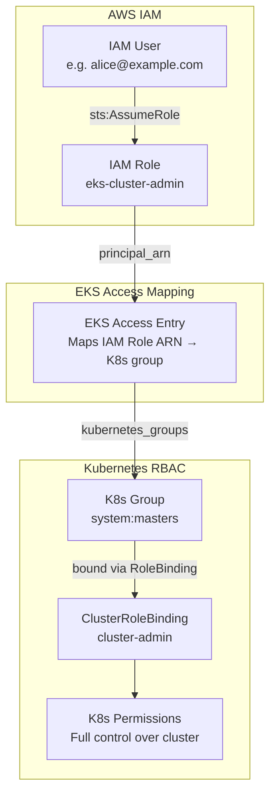
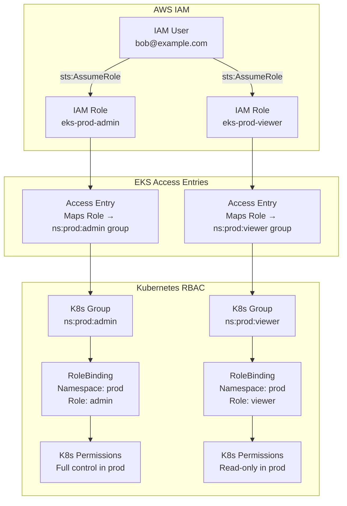

Excellent request 👏 — visualizing the relationship between **IAM users**, **IAM roles**, **EKS access entries**, and **Kubernetes RoleBindings** makes it much easier to understand how AWS IAM integrates with EKS RBAC.

Below are **two Mermaid diagrams** (fully compatible with your VS Code *Markdown Preview Mermaid Support* plugin).
They are simplified but technically accurate to your setup from `8-iam_roles.tf`.

---

## 🧩 Diagram 1 — IAM → EKS Integration Flow

This shows how an **IAM User** assumes an **IAM Role**, which is then mapped via **EKS Access Entry** to a **Kubernetes group**, and finally bound to Kubernetes permissions.



### 🧠 Explanation

| Step                                    | Description                                                                       |
| --------------------------------------- | --------------------------------------------------------------------------------- |
| **1. IAM User**                         | Logs in via AWS CLI or console (`aws sts assume-role`)                            |
| **2. IAM Role**                         | Represents EKS identity; defined in Terraform (e.g., `<cluster>-cluster-admin`)   |
| **3. EKS Access Entry**                 | Tells the EKS control plane: “this IAM role maps to Kubernetes group(s)”          |
| **4. Kubernetes Group**                 | Group name recognized by EKS (e.g., `system:masters` or namespace-specific group) |
| **5. RoleBinding / ClusterRoleBinding** | Connects group to RBAC permissions (admin/viewer/etc.)                            |
| **6. Kubernetes RBAC**                  | Applies final permissions inside the cluster                                      |

---

## ☸️ Diagram 2 — Namespace-Level Example (Admin / Viewer roles)

This one illustrates **per-namespace access**, showing how users assume namespace-scoped roles (like `<cluster>-prod-admin`).



### 🧠 Explanation

| Component                     | Description                                                           |
| ----------------------------- | --------------------------------------------------------------------- |
| **IAM Role (eks-prod-admin)** | Trusted only by users allowed to manage `prod` namespace              |
| **EKS Access Entry**          | Maps the role ARN to a K8s group like `ns:prod:admin`                 |
| **Kubernetes RoleBinding**    | Binds that group to an RBAC role granting admin rights in `prod`      |
| **IAM User**                  | Can assume the role, then operate within `prod` namespace accordingly |

---

## 🏗️ Diagram 3 — Complete Logical Hierarchy

This optional global view summarizes the entire identity chain between AWS IAM and Kubernetes RBAC.

```mermaid
flowchart LR
    subgraph IAM["AWS IAM"]
        I1[IAM User]
        I2[IAM User Policy<br/>Allow sts:AssumeRole]
        I3[IAM Role<br/>e.g., cluster-viewer / ns-admin]
        I4[Trust Policy<br/>Allows specific IAM users]
    end

    subgraph EKS["EKS Cluster"]
        E1[EKS Access Entry<br/>principal_arn = IAM Role ARN]
        E2[K8s Group(s)<br/>e.g., system:viewers]
    end

    subgraph K8S["Kubernetes"]
        K1[ClusterRoleBinding / RoleBinding]
        K2[ClusterRole / Role<br/>Defines actual permissions]
    end

    I1 --> I2 --> I3
    I3 --> I4
    I3 --> E1
    E1 --> E2
    E2 --> K1 --> K2
```

---

## ✅ Summary

| Layer                            | Terraform Resource             | AWS or K8s Entity  | Purpose                                      |
| -------------------------------- | ------------------------------ | ------------------ | -------------------------------------------- |
| IAM User                         | `aws_iam_user`                 | IAM user           | Human identity                               |
| User Policy                      | `aws_iam_user_policy`          | Inline IAM policy  | Grants right to assume allowed roles         |
| IAM Role                         | `aws_iam_role`                 | IAM role           | EKS access identity (admin/viewer/ns-scoped) |
| Trust Policy                     | `data.aws_iam_policy_document` | Trust relationship | Restricts who can assume the role            |
| EKS Access Entry                 | `aws_eks_access_entry`         | EKS mapping        | Maps IAM Role ARN → Kubernetes group         |
| RoleBinding / ClusterRoleBinding | (created inside cluster)       | K8s binding        | Connects K8s group → Role permissions        |
| Role / ClusterRole               | (Kubernetes)                   | RBAC definition    | Actual permissions (admin/viewer)            |

---

Would you like me to add a **4th diagram** showing the same flow but from the **“command path” perspective** — e.g., when a user runs
`aws eks update-kubeconfig --role-arn <role>` → how credentials flow into the cluster authentication?


# 🧭 EKS IAM Role Access Guide

**Version:** 1.0  
**Purpose:**  
This guide explains how to configure AWS IAM users to assume the roles created by the Terraform **Access Control Module** and use them to access your EKS clusters securely.

---

## 📘 Overview

Terraform creates and manages:
| Resource Type | Example Name | Purpose |
|----------------|---------------|----------|
| **IAM Role** | `eks-test-cluster-cluster-admin` | Defines cluster-level permissions for EKS |
| **IAM User Policy** | Inline policy per IAM user | Grants `sts:AssumeRole` and `eks:DescribeCluster` |
| **EKS Access Entry** | Maps IAM Role → Kubernetes RBAC group | Determines K8s permissions once the role is assumed |

This ensures a secure mapping:
> **AWS IAM User → IAM Role → EKS Access Entry → Kubernetes RBAC Group**

---

## ⚙️ 1. Configure AWS CLI Profiles

Each user needs **two AWS CLI profiles** in their configuration.

### Example for user `alice`

#### `~/.aws/credentials`
```ini
[alice]
aws_access_key_id = AKIAEXAMPLE123
aws_secret_access_key = abcdEXAMPLExyz123
